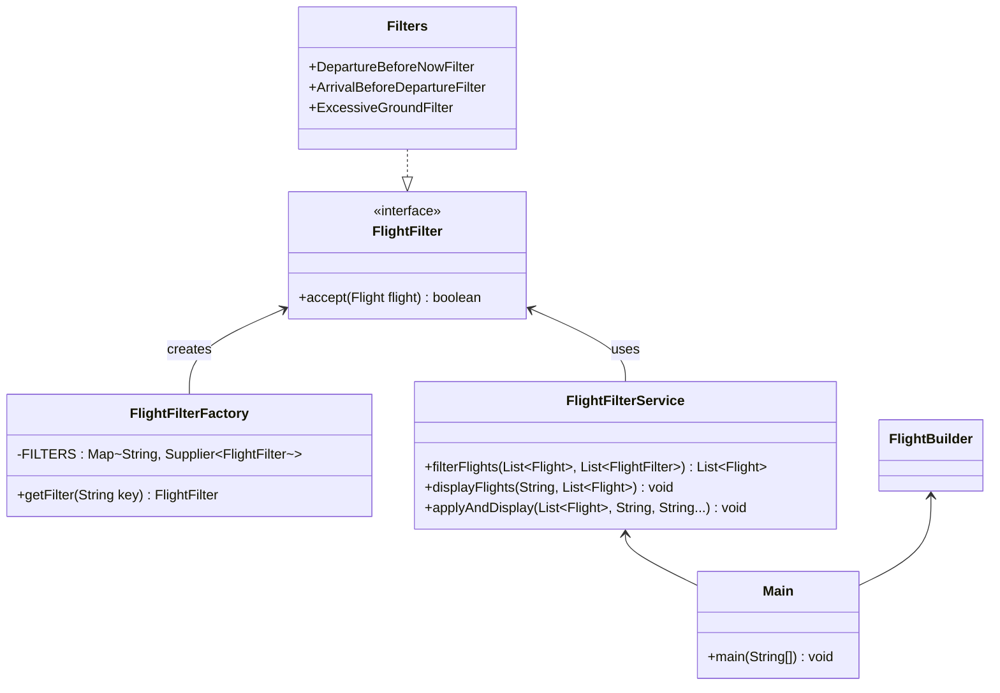

# Flight Filtering System - Java Developer Test Solution

[](https://java.com)
[](https://en.wikipedia.org/wiki/Design_Patterns)
[](https://opensource.org/licenses/MIT)

A configurable Java module for filtering aviation flights based on dynamic rules, implementing Strategy and Factory design patterns.

## 📋 Overview
This solution implements a flight filtering system that processes aviation flights according to configurable rules. The module efficiently handles large datasets and allows dynamic filter configuration at runtime.

Core filters implemented:
1. 🕒 **Exclude flights departing before current time**
2. ⚠️ **Exclude flights with invalid segments** (arrival before departure)
3. ⏳ **Exclude flights with excessive ground time** (>2 hours)

## 🚀 Getting Started

### Prerequisites
- Java 17 or higher

### Running the Application
```bash
# Clone the repository
git clone https://github.com/jsrend/flight-filtering-system.git

# Navigate to project directory
cd flight-filtering-system

# Or run directly
java -cp target/classes com.jsrend.testing.Main
```

### Sample Output
```
All flights
[2025-06-28T15:41|2025-06-28T17:41]
[2025-06-28T15:41|2025-06-28T17:41] [2025-06-28T18:41|2025-06-28T20:41]
[2025-06-22T15:41|2025-06-28T15:41]
[2025-06-28T15:41|2025-06-28T09:41]
[2025-06-28T15:41|2025-06-28T17:41] [2025-06-28T20:41|2025-06-28T21:41]
[2025-06-28T15:41|2025-06-28T17:41] [2025-06-28T18:41|2025-06-28T19:41] [2025-06-28T21:41|2025-06-28T22:41]
...

No flights in the past
[2025-06-28T15:41|2025-06-28T17:41]
[2025-06-28T15:41|2025-06-28T17:41] [2025-06-28T18:41|2025-06-28T20:41]
[2025-06-28T15:41|2025-06-28T09:41]
[2025-06-28T15:41|2025-06-28T17:41] [2025-06-28T20:41|2025-06-28T21:41]
[2025-06-28T15:41|2025-06-28T17:41] [2025-06-28T18:41|2025-06-28T19:41] [2025-06-28T21:41|2025-06-28T22:41]
...

Exclude segments with arrival before departure
[2025-06-28T15:41|2025-06-28T17:41]
[2025-06-28T15:41|2025-06-28T17:41] [2025-06-28T18:41|2025-06-28T20:41]
[2025-06-22T15:41|2025-06-28T15:41]
[2025-06-28T15:41|2025-06-28T17:41] [2025-06-28T20:41|2025-06-28T21:41]
[2025-06-28T15:41|2025-06-28T17:41] [2025-06-28T18:41|2025-06-28T19:41] [2025-06-28T21:41|2025-06-28T22:41]
...

No long waits on the ground
[2025-06-28T15:41|2025-06-28T17:41]
[2025-06-28T15:41|2025-06-28T17:41] [2025-06-28T18:41|2025-06-28T20:41]
[2025-06-22T15:41|2025-06-28T15:41]
[2025-06-28T15:41|2025-06-28T09:41]
...
```

## 🧩 System Design

### Design Patterns
| Pattern       | Implementation          | Benefit                          |
|---------------|-------------------------|----------------------------------|
| **Strategy**  | `FlightFilter` interface | Decouples filtering algorithms   |
| **Factory**   | `FlightFilterFactory`   | Centralized object creation      |
| **Facade**    | `FlightFilterService`   | Simplifies complex operations    |

### Class Diagram


## 🛠️ Extending the System

### Adding New Filters
1. Create a new filter class implementing `FlightFilter`:
```java
public class DurationLimitFilter implements FlightFilter {
    private static final int MAX_FLIGHT_HOURS = 12;

    @Override
    public boolean accept(Flight flight) {
        long totalMinutes = 0;
        List<Segment> segments = flight.getSegments();
        
        if (!segments.isEmpty()) {
            LocalDateTime start = segments.get(0).getDepartureDate();
            LocalDateTime end = segments.get(segments.size()-1).getArrivalDate();
            totalMinutes = ChronoUnit.MINUTES.between(start, end);
        }
        
        return totalMinutes <= (MAX_FLIGHT_HOURS * 60);
    }
}
```

2. Register the filter in `FlightFilterFactory`:
```java
static {
    FILTERS.put("durationLimit", DurationLimitFilter::new);
}
```

3. Use your new filter:
```java
// Single filter
FlightFilterService.applyAndDisplay(flights, 
    "Flights under 12 hours", 
    "durationLimit");

// Combined with existing filters
FlightFilterService.applyAndDisplay(flights,
    "Valid flights under 12 hours",
    "departureBeforeNow",
    "arrivalBeforeDeparture",
    "durationLimit");
```

## 📂 Project Structure
```
src/main/java/com/jsrend/testing/
├── Filters.java                # Filter implementations
├── FlightFilter.java           # Core filter interface
├── FlightFilterFactory.java    # Filter instantiation
├── FlightFilterService.java    # Filter operations facade
├── Main.java                   # Application entry point
└── TestClasses.java            # Test flight generator (provided)
```

## ✅ Requirements Verification
| Requirement | Status | Implementation Details |
|-------------|--------|------------------------|
| Filter flights with departure before now | ✅ | `DepartureBeforeNowFilter` |
| Filter flights with invalid segments | ✅ | `ArrivalBeforeDepartureFilter` |
| Filter flights with >2h ground time | ✅ | `ExcessiveGroundFilter` |
| Dynamic filter configuration | ✅ | `FlightFilterFactory` + `FlightFilterService` |
| Strategy pattern implementation | ✅ | `FlightFilter` interface |
| Factory pattern implementation | ✅ | `FlightFilterFactory` |
| Console output | ✅ | `FlightFilterService.displayFlights()` |
| Large dataset support | ✅ | Parallel stream processing |
| No external libraries | ✅ | Pure Java 17 solution |


## 📄 License
This project is licensed under the MIT License - see the [LICENSE](LICENSE) file for details.